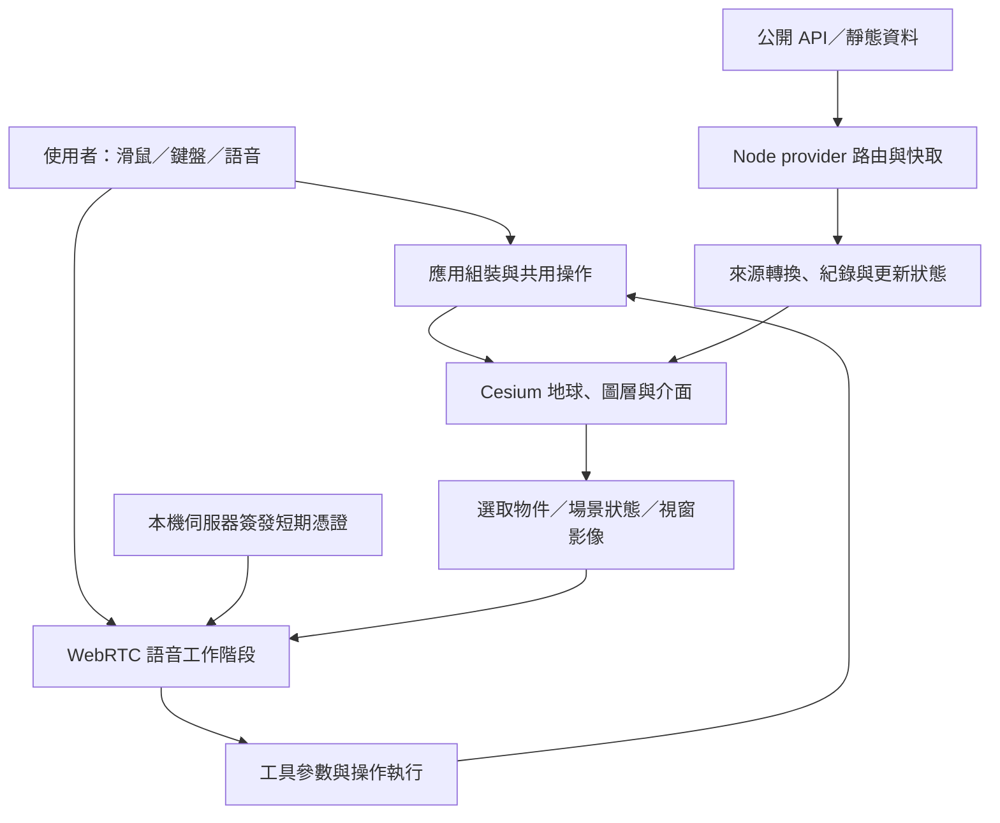

# God’s Eye View：影片與專案分析

分析日期：2026-09-17。對象：[PAPAYA 電腦教室影片](https://youtu.be/tlEnf7P7wDA)與 [God’s Eye View 原始碼](https://github.com/bilawalsidhu/gods-eye-view)。

## 判斷

God’s Eye View 值得作為「3D 地球、多來源資料整合、語音操作」的研究與原型基礎。它的主要價值是把分散的公開資料放進同一個可互動的空間，讓使用者快速理解位置關係。畫面具有情報控制台的風格，但不能據此推論資料達到情報機構的完整度、精度或時效。

若目標是個人探索、地理教學或互動展示，現有專案已提供豐富功能。若要做台灣在地服務、持續運作的監測系統或商用產品，主要工作會是補齊在地資料、標示資料品質、處理供應商依賴及逐項確認素材使用條件；換介面並不足以完成產品化。

本次是原始碼與文件分析，沒有完成應用啟動、真實資料連線或語音端到端驗收。

## 影片：可以確認與不能確認的部分

影片作者為 PAPAYA 電腦教室，長度約 10 分 49 秒。YouTube 頁面提供標題、說明與章節；字幕軌存在，但字幕請求回傳空內容。因此以下是依章節整理的主題對照，並非逐字稿分析，也不代表已逐幀觀看影片。

| 時間 | 影片章節主題 | 原始碼／資料文件核對時的重點 |
|---|---|---|
| 00:00 | 安裝 | 現行專案要求 Node 24.14+ 的 24.x 或 26.x；安裝步驟以固定版本文件為準 |
| 01:58 | 擬真 3D | 需影像／3D 圖資供應商支援；不同區域的精細模型覆蓋不能預設相同 |
| 02:45 | 廣播 | 地理位置與電台串流結合；不是衛星截收功能 |
| 03:21 | 衛星 | 軌道資料經模型計算位置，並非取得所有衛星的即時遙測 |
| 04:03 | 太空任務 | 發射事件資訊與軌跡重建要分開理解 |
| 04:36 | 地震、海纜 | 地震事件資料與靜態海纜資料的更新性質不同 |
| 05:14 | 車流 | 道路上的個別車輛為模擬；有流速資料不等於追蹤每台車 |
| 06:21 | 監視器 | 公開來源攝影機整合；不代表能存取任意路口 |
| 07:38 | 航班 | 收到的公開航跡受資料覆蓋、回報頻率與缺漏限制 |
| 08:44 | AI 語音 | 語音代理呼叫應用工具操作地圖，能力仍受底層資料與工具限制 |

來源：[影片說明欄與章節](https://www.youtube.com/watch?v=tlEnf7P7wDA)。現行 main 分支可能比拍片版本更新，本報告不假設兩者功能完全一致。

## 真實、推算、模擬與靜態資料

| 類型 | 資料如何進入畫面 | 解讀限制 |
|---|---|---|
| 航班、部分軍用航空器 | OpenSky、adsb.lol 等公開位置回報，再經插值／外推呈現移動 | 畫面平順不等於回報連續；沒顯示不能推論不存在 |
| 船舶 | AISStream 提供的 AIS 訊息 | 需要金鑰；接收範圍、缺訊與資料過期仍影響結果 |
| 衛星 | CelesTrak 軌道元素搭配 satellite.js 計算 | 屬模型預測位置；精度取決於軌道資料與時間 |
| 地震 | USGS 事件資料 | 事件發布、修訂與資料更新各有時間差 |
| 道路交通 | OSM 道路幾何上的車輛模擬，可用 TomTom 流速驅動 | 個別車輛位置不是實測；不適合估算某輛車的行蹤 |
| CCTV | 指定地區公開影像／快照及攝影機位置 | 姿態、投影與視域採估計；影像不是完整城市數位孿生 |
| 火點 | NASA FIRMS 偵測資料 | 需金鑰；不能把每個火點視為即時現場影像或已確認災情 |
| 火箭 | 發射資料及重建的飛行路徑 | 重建展示不能當成真實飛行遙測 |
| 海纜、水壩、資料中心 | 隨專案附帶的靜態資料集 | 不能直接解讀成設施目前運作狀態 |
| 夜視、熱像與偵測框 | 著色效果、已知場景實體投影和標籤 | 不等同真正紅外感測或對全畫面的通用物件辨識 |

依據：[資料來源說明](https://github.com/bilawalsidhu/gods-eye-view/blob/0d41b6be5490db1f10a171f238be75db4d4ec3b4/DATA_SOURCES.md)、[航跡顯示數學](https://github.com/bilawalsidhu/gods-eye-view/blob/0d41b6be5490db1f10a171f238be75db4d4ec3b4/src/data/motionModel.js)、[偵測框繪製工具](https://github.com/bilawalsidhu/gods-eye-view/blob/0d41b6be5490db1f10a171f238be75db4d4ec3b4/src/data/detectionDraw.js)。

最應補強的產品資訊是每一筆資料的來源、來源時間、取得時間、推算狀態與過期狀態。這些標記能避免視覺效果掩蓋資料品質差異。

## 技術架構

專案使用 JavaScript ES Modules、Vite、Cesium，另搭配 satellite.js 等資料處理函式庫。套件清單沒有把 React 當作核心依賴；閱讀與改造應從現有模組與生命週期入手。[package.json](https://github.com/bilawalsidhu/gods-eye-view/blob/0d41b6be5490db1f10a171f238be75db4d4ec3b4/package.json)

這是概念性資料流；部分圖資由瀏覽器直接向供應商載入，並非所有請求都通過本機代理。

| 路徑 | 主要責任 | 改造時的意義 |
|---|---|---|
| `src/app/` | 組裝、啟動、取消與清理 | 可注入元件；避免把全域狀態散落在新功能 |
| `src/layers/` | 各類圖層的資料與 Cesium 資源 | 新資料源應沿既有圖層分工加入 |
| `src/sources/` | 來源協定與可移植資料契約 | 將資料正規化與畫面呈現分開 |
| `src/ui/` | 面板、輸入、視覺狀態 | 中文化與互動修改的主要位置之一 |
| `src/voice/` | 工具契約、執行、連線、取消與狀態 | 語音可靠度仰賴工具結果與工作階段管理 |
| `server/providers/` | 第三方服務路由、快取與清理 | 在地 API、金鑰及服務限制的接入點 |
| `server/standalone/` | 本機設定與伺服器組裝 | 本機設定流程不等同公網產品後端 |

`createApplication` 明確定義 scene → controls → data → tools 啟動順序，並以 AbortSignal 及清理函式處理取消與銷毀。這比單一大型展示腳本更適合擴充，但仍有相容入口與舊模組，不能只看檔名就認定所有 ingestion 程式均能獨立使用。[應用生命週期](https://github.com/bilawalsidhu/gods-eye-view/blob/0d41b6be5490db1f10a171f238be75db4d4ec3b4/src/app/application.js)、[模組邊界](https://github.com/bilawalsidhu/gods-eye-view/blob/0d41b6be5490db1f10a171f238be75db4d4ec3b4/docs/CODE-BOUNDARIES.md)

## 語音操作的實際機制

程式在伺服器端使用長期 API 金鑰建立短期 Realtime 憑證，瀏覽器取得麥克風並建立 WebRTC 連線。模型透過工具契約提出動作，應用再執行飛行、追蹤、圖層或標註等操作。場景與選取物件資訊能協助回答地理問題；視窗影像也可成為理解畫面的輸入。

工程難點在多步動作、取消舊指令、工具執行失敗、影像擷取完成時使用者已切換位置，以及廣播播放與語音互相干擾。專案已將 connection、turns、input、radio、viewport、cost 等責任拆開；這是值得參考的設計。

來源：[Realtime 憑證路由](https://github.com/bilawalsidhu/gods-eye-view/blob/0d41b6be5490db1f10a171f238be75db4d4ec3b4/server/providers/openai/realtime.js)、[瀏覽器連線](https://github.com/bilawalsidhu/gods-eye-view/blob/0d41b6be5490db1f10a171f238be75db4d4ec3b4/src/voice/realtimeConnection.js)、[語音模組分工](https://github.com/bilawalsidhu/gods-eye-view/blob/0d41b6be5490db1f10a171f238be75db4d4ec3b4/docs/VOICE-OWNERSHIP.md)。本次未測中文辨識率、延遲或多步指令成功率。

## 本機使用與成本評估

可以先用免金鑰資料與基本地圖探索；擬真 3D、船舶、火點及語音等能力各有自己的供應商條件。不可把「原始碼免費」理解成所有外部服務永久免費，也不宜直接用別人的展示效能推估這台電腦的表現。

| 路線 | 適用情境 | 需要另外驗證 |
|---|---|---|
| 基本地圖＋免金鑰圖層 | 功能探索、架構學習 | 網路連通、來源速率限制、地區覆蓋 |
| 加入擬真 3D | 城市展示、地形與建物瀏覽 | 供應商方案、當地 3D 覆蓋、GPU 與圖磚流量 |
| 加入語音 | 自然語言操作展示 | 帳戶權限、用量、語言效果與操作成功率 |
| 多人或公網服務 | 團隊工具、產品原型 | 身分驗證、服務端限流、快取、成本管理與資料條件 |

本機 `node --version` 為 **v22.23.2**；專案 engines 為 `>=24.14.0 <25 || >=26 <27`。若下一步要啟動，應先使用符合範圍的專案專用 Node 環境，再執行 `npm ci`、`npm run doctor` 與 `npm run dev`。本次沒有更動系統 Node 或設定任何付費 API 金鑰。[執行環境要求](https://github.com/bilawalsidhu/gods-eye-view/blob/0d41b6be5490db1f10a171f238be75db4d4ec3b4/package.json)、[設定範本](https://github.com/bilawalsidhu/gods-eye-view/blob/0d41b6be5490db1f10a171f238be75db4d4ec3b4/.env.example)

## 素材條件與部署邊界

專案 LICENSE 明確把 MIT 原始碼與第三方資料分開。海底電纜資料被標為 CC BY-NC-SA，Bhote Koshi 事件素材及部分衍生座標也有非商用限制；3D 模型另有各自的來源與授權。這是專案文件中的明示條件，不是本次對法律適用所做的獨立判定。商用評估應逐項檢查實際會載入及打包的資料，不能只看套件的 MIT 欄位。[LICENSE](https://github.com/bilawalsidhu/gods-eye-view/blob/0d41b6be5490db1f10a171f238be75db4d4ec3b4/LICENSE)、[素材與資料來源](https://github.com/bilawalsidhu/gods-eye-view/blob/0d41b6be5490db1f10a171f238be75db4d4ec3b4/DATA_SOURCES.md)、[3D 模型來源](https://github.com/bilawalsidhu/gods-eye-view/blob/0d41b6be5490db1f10a171f238be75db4d4ec3b4/public/models/README.md)

部署面，瀏覽器圖資憑證與服務端金鑰的處理方式不同；前者本就可能在瀏覽器可見。Realtime 路由中的限流為可選設定，不能將本機預設設定直接視為多人服務的完整保護。公開部署前需檢查所有付費路由與管理介面的存取策略。[環境設定](https://github.com/bilawalsidhu/gods-eye-view/blob/0d41b6be5490db1f10a171f238be75db4d4ec3b4/.env.example)、[Realtime 路由](https://github.com/bilawalsidhu/gods-eye-view/blob/0d41b6be5490db1f10a171f238be75db4d4ec3b4/server/providers/openai/realtime.js)

## 若要做台灣版本

以下為改造建議，尚未進行台灣資料供應商接入或服務條件調查：

1. 先固定台北、桃園機場、高雄港等少數展示場景，實測地圖品質與現有航班／船舶覆蓋，避免先假設全台都有同等細節。
2. 將繁體中文介面、台灣地名解析、時區與常用單位做好，再驗收中文語音對同音地名及混合英文代碼的操作。
3. 分別評估氣象／地震、交通、公共運輸及公開 CCTV 的在地官方來源；接入前確認授權、更新頻率、認證與服務限制。
4. 為每個圖層顯示資料時間與覆蓋說明；插值、模擬、靜態快照使用不同標記。
5. 先讓單一新資料源完成斷線、缺值、過期與取消載入測試，再擴大圖層數量。

建議第一個成果是「台灣場景＋少數穩定圖層＋來源時間標示」。進階語音和視覺效果可隨後加入，驗收時以資料正確性與操作成功率為主。

## 驗證紀錄與信心界線

- 已下載 GitHub 原始碼，固定 commit：`0d41b6be5490db1f10a171f238be75db4d4ec3b4`。
- commit 時間：2026-09-16T11:57:56-07:00；package version：0.1.1。
- 已閱讀套件／環境設定、授權資料、架構邊界、應用生命週期、Realtime 連線及憑證路由、航跡與偵測標籤部分程式。
- 抽樣執行三個測試檔：`src/app/application.test.mjs`、`src/data/motionModel.test.mjs`、`src/voice/actionSchemas.test.mjs`。
- 測試 runner 回報 19 項結果，17 通過、2 失敗。兩項失敗都涉及未安裝 `cesium`，其中 motionModel 測試檔未能載入；這不是完整測試數量，也不能據此判斷該模組本身有缺陷。
- 未安裝依賴、未建置、未啟動瀏覽器驗證、未測即時供應商或語音；不宣稱此版本已在本機正常運作。
- `KNOWN-ISSUES.md` 標示更新日期為 2026-07-08，部分內容可能落後於本次 commit，僅作維護線索，不把列出項目當成本次重現的缺陷。
- 影片僅完成標題、說明與章節核對；沒有取得可讀字幕或完整影音觀察證據。

附檔：`evidence/verification.txt` 為原始抽樣測試紀錄；`evidence/video_metadata.json` 為精簡影片資訊；`evidence/manifest.json` 記錄分析版本與限制；`source/` 保留未修改的 Git checkout。

## 建議決策

**值得研究，也適合做互動展示原型。** 若希望完成可長期使用的台灣地理資訊工具，應把投入集中在來源品質、在地化與可靠性驗證。現階段最合理的下一步是使用相容 Node 版本完成免金鑰啟動與台灣場景測試，再根據實際效果決定要加入哪些服務。
